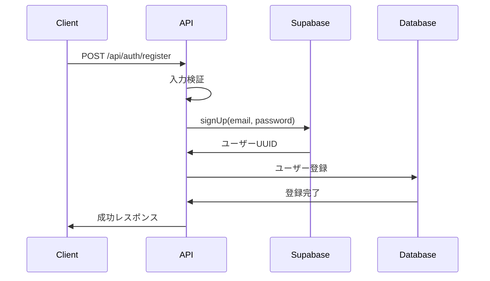

# 初めに
この章ではsupabaseとnext.jsを使ったメール認証について取り扱います。

この章での目的は以下の通りです。
- emailとpasswordを使ってユーザー認証する
- ミドルウェアによる認証済みユーザーのルーティング
- ユーザー情報として、ユーザー名やアイコンを登録する


**ほかの記事一覧**
- prismaとsupabaseの設定。
- supabaseとnext.jsを使ったユーザー認証、ミドルウェア
- prismaを使ったcrud操作
- supabase storageを使って画像を保存する方法

## どのように実装するのか

ユーザーの認証には`Supabase Auth`を使います。
Supabase Authには`auth.users`テーブルが用意されており、Emailやパスワードを登録することができます。
ここで大事な点としては**auth.usersにはemailとパスワードしか登録できない**ということです。
そのため、その他の情報は別テーブルとしてリレーションし、保存する方法がよいと思います。

## データベース設計について
この記事では、Supabaseの`auth.users`テーブルと独自の`User`テーブルを併用する設計を採用しています。
個人的には`profile`テーブルを作って


## セットアップ
### パッケージのインストール
まずはパッケージのインストールをします。以下を実行してください。
```bash
npm install @supabase/ssr @supabase/supabase-js
```
### supabaseクライアントの作成
次にSupabaseクライアント[^1]の作成を行います。
[^1]: クライアントとは簡単に言うとアクセスするための起点です。これを設定することでSupabaseやPrismaをコード上で使えるようになります。
`utils/supabase`の中に`server.ts`と`client.ts`を準備し、以下のように記載

```ts:utils/supabase/server.ts
import { createServerClient } from "@supabase/ssr";
import { cookies } from "next/headers";

export async function createClient() {
  const cookieStore = await cookies();

  return createServerClient(
    process.env.NEXT_PUBLIC_SUPABASE_URL!,
    process.env.NEXT_PUBLIC_SUPABASE_ANON_KEY!,
    {
      cookies: {
        getAll() {
          return cookieStore.getAll();
        },
        setAll(cookiesToSet) {
          try {
            cookiesToSet.forEach(({ name, value, options }) =>
              cookieStore.set(name, value, options),
            );
          } catch {
            // The `setAll` method was called from a Server Component.
            // This can be ignored if you have middleware refreshing
            // user sessions.
          }
        },
      },
    },
  );
}
```
```ts:utils/supabase/client.ts
import { createBrowserClient } from "@supabase/ssr";

const supabaseUrl = process.env.NEXT_PUBLIC_SUPABASE_URL!;
const supabaseAnonKey = process.env.NEXT_PUBLIC_SUPABASE_ANON_KEY!;

export const createClient = () =>
  createBrowserClient(supabaseUrl, supabaseAnonKey);
```

これで`createClient()`を呼び出すことでSupabaseにアクセスできるようになりました。
サーバーサイドで実行する場合は`server.ts`のクライアントを呼び出します。
クライアントで呼び出す場合は`client.ts`のクライアントを呼び出します。


### prismaクライアントの作成
最後にprismaクライアントを作成します。
`lib/prisma.ts`を作成し、以下のように記載。
```ts:lib/prisma.ts
import { PrismaClient } from "@prisma/client";
declare global {
  var prisma: PrismaClient | undefined;
}

const prisma = global.prisma || new PrismaClient();

if (process.env.NODE_ENV === "development") global.prisma = prisma;

export const db = prisma;
```

最後に以下を実行します。
```bash
npx prisma generate
```

これでprismaクライアントを作成できました。
`db`を呼び出すことでデータベースを操作できるようになりました。

## ユーザー登録
次にユーザー登録について実装します。
Next.jsには`API Routes`と`Server Actions`があり、どちらでも実装できますが、
`API Routes`を使って実装してみます。
`app/api/auth/register/route.ts`を作成し、以下のように記載します。
```ts:api/auth/register/route.ts
import { createClient } from "@/utils/supabase/server";
import { NextRequest, NextResponse } from "next/server";
import { db } from "@/lib/prisma";

export async function POST(req: NextRequest) {
  try {
    const { name, email, password } = await req.json();

    if (!name || !email || !password) {
      return NextResponse.json(
        { error: "入力項目が不足しています" },
        { status: 400 },
      );
    }

    const supabase = await createClient(); // awaitをつける

    const { data, error } = await supabase.auth.signUp({ 
      email,
      password,
    });

    // ユーザー登録に失敗
    if (error) {
      return NextResponse.json(
        { error: error.message }, // supabaseからのエラーメッセージ
        { status: 400 },
      );
    }

    // Supabaseの登録に成功
    const userId = data.user?.id; // Supabaseに登録したUUIDを使用する。
    if (!userId) {
      return NextResponse.json(
        { error: "ユーザーIDが取得できませんでした" },
        { status: 400 },
      );
    }

    // Userテーブルにユーザー情報を登録する。
    try {
      await db.user.create({
        data: {
          id: userId,
          name,
          email,
          userIcon: "/default-icon.jpeg",
        },
      });
      // ユーザー登録に失敗した場合
    } catch (error) {
      // Supabaseのユーザーも削除する
      await supabase.auth.admin.deleteUser(userId);

      return NextResponse.json(
        { error: "ユーザー登録に失敗しました。" },
        { status: 400 },
      );
    }

    // 登録に成功
    return NextResponse.json(
      { message: "ユーザー登録に成功しました" },
      { status: 200 },
    );
  } catch (error) {
    return NextResponse.json(
      { error: "サーバーエラーが発生しました。" },
      { status: 500 },
    );
  }
}
```