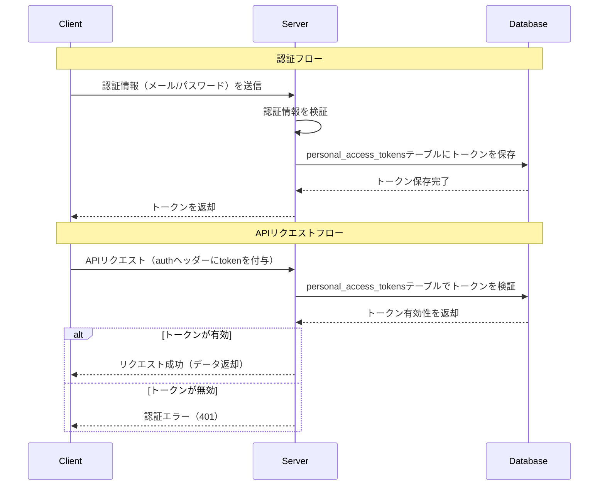

# はじめに
今回はLaravelとSanctumを使ってAPIトークン認証を実装します。

実行環境は以下の通りです。
- Composer : 2.8.12
- Laravel : 11系

## APIトークン認証について
APIトークン認証では以下のようなフローになっています。

APIトークン認証では`personal_access_tokens`テーブルにトークン情報を保存します。
ユーザーにはハッシュ化されたトークンのみを返却するため、元のトークン値は分かりません。
`personal_access_tokens`テーブルには、トークンの有効期限やどのモデルと紐付いているかなどの情報が保存されます。

## Sanctumのインストール
```bash
php artisan install:api
```
実行すると、マイグレーションファイルや`api.php`などが作成されます。

## モデルの設定
### Userモデルと紐付ける
```php
use Laravel\Sanctum\HasApiTokens;
class User extends Authenticatable
{
    /** @use HasFactory<\Database\Factories\UserFactory> */
    use HasFactory, Notifiable, HasApiTokens;
}
```
認証対象のモデルに`HasApiTokens`トレイトを追加することで、トークン機能と関連付けることができます。

### PersonalAccessTokenモデルをカスタマイズする
次に`PersonalAccessToken`モデルを継承してカスタマイズします。
型のキャストや拡張が不要な場合、この手順はスキップできます。
```php:Models/PersonalAccessToken
<?php
use Laravel\Sanctum\PersonalAccessToken as SanctumPersonalAccessToken;

class PersonalAccessToken extends SanctumPersonalAccessToken
{
    protected $casts = [
        'abilities' => 'array', // 必須
        'expires_at' => 'datetime',
        'last_used_at' => 'datetime',
    ];
}
```
注意点として、キャストを設定する場合は`'abilities' => 'array'`の指定が必須です。
カスタムモデルを反映させるために`AppServiceProvider`の`boot`メソッドを編集します。
```php
    public function boot(): void
    {
        Sanctum::usePersonalAccessTokenModel(PersonalAccessToken::class);
    }
```
## トークンの生成
```php
    public function execute(RegisterUserInput $input): RegisterUserOutput
    {
        if ($this->userRepository->existsUserByEmail($input->email)) {
            throw new UserAlreadyExistsException();
        }

        $user = $this->userRepository->create([
            'email' => $input->email,
            'password' => Hash::make($input->password)
        ]);

        $token = $user->createToken('access_token')->plainTextToken;
        return new RegisterUserOutput(
            token: $token,
        );
    }
```
`createToken()`でトークン名を指定してトークンを作成します。作成されたトークンは自動的に`personal_access_tokens`テーブルに保存されます。
`plainTextToken`プロパティで平文のトークンを取得できます。

### createToken()について
`createToken()`は第2引数でトークンにスコープ（権限）を持たせることができます。
`createToken('token-name', ['server:update'])`のように指定することで、トークンが特定のアビリティを持っているか判断し、それに応じた分岐処理ができます。
```php
if ($user->tokenCan('server:update')) {
    // ...
}

if ($user->tokenCant('server:update')) {
    // ...
}
```
また、第3引数でトークンに個別の有効期限を設定することもできます。
`createToken('token-name', ['*'], now()->addWeek())`のように指定します。

## トークンの有効期限
`config/sanctum.php`でトークンの有効期限を設定できます。デフォルトは`null`（無期限）です。
```php
'expiration' => 525600,
```

## ミドルウェア
```php
use Illuminate\Http\Request;

Route::get('/user', function (Request $request) {
    return $request->user();
})->middleware('auth:sanctum');
```
`middleware('auth:sanctum')`を指定することで、認証ミドルウェアが自動的に適用されます。
認証失敗時のレスポンスをカスタマイズしたい場合は、`bootstrap/app.php`を編集します。
```php
return Application::configure(basePath: dirname(__DIR__))
    ->withRouting(
        web: __DIR__ . '/../routes/web.php',
        api: __DIR__ . '/../routes/api.php',
        commands: __DIR__ . '/../routes/console.php',
        health: '/up',
    )
    ->withMiddleware(function (Middleware $middleware): void {
        //
    })
    ->withExceptions(function (Exceptions $exceptions): void {
        // 認証失敗時のレスポンスをカスタマイズ
        $exceptions->render(function (AuthenticationException $_, $request) {
            return response()->json([
                'status' => 'error',
                'message' => '認証に失敗しました。',
            ], 401);
        });
    })->create();
```

## トークンの削除
```php
$request->user()->currentAccessToken()->delete();
```
認証済みユーザーの現在のトークンを削除することができます。
`$request->user()->currentAccessToken()`が`null`になる可能性があり、`delete()`がエラーになる懸念がありますが、ミドルウェアで不正なトークンは事前に検出されるため、問題ありません。
## 参考
https://laravel.com/docs/11.x/sanctum
https://readouble.com/laravel/11.x/ja/sanctum.html