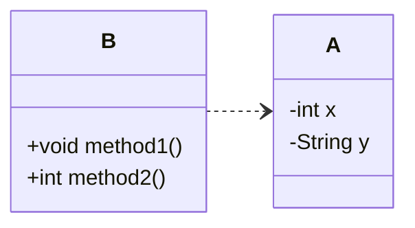
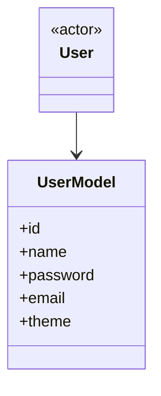
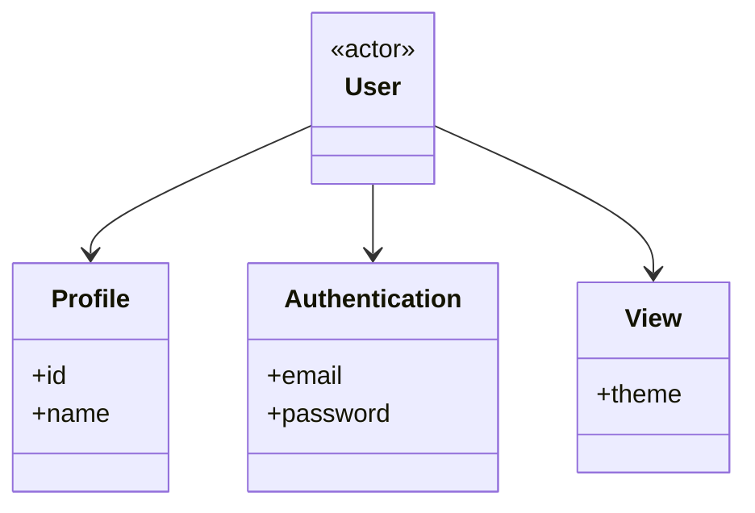

# はじめに
『良いコード／悪いコードで学ぶ設計入門』[^1] を読んで、印象に残った要点をまとめてみます。
本書は章ごとにテーマが整理されているので、本記事でも各章で得た気づきを順にまとめていきます。
[^1]:https://gihyo.jp/book/2025/978-4-297-14622-1

## 第3章（カプセル化）
### カプセル化とは
変更をしやすくする手段の一つとして、`カプセル化` があります。
`カプセル化` とは、あるデータとそのデータを扱うロジックをひとまとめにすることです。Java や C# などのオブジェクト指向言語では、主にクラスでこれを実現します。

### なぜカプセル化が必要なのか
大切なのは、`クラスが単体で正常に動くこと` です。
たとえば、次のような設計になっていたとします。

この構造では、インスタンス変数を操作するロジックが別クラス[^2]に定義されているため、データと処理の対応関係が見えにくくなります。その結果、修正漏れやロジックの重複が起きやすくなります。
こうした状態を避けるには、インスタンス変数とメソッドを同じクラスにまとめ、不正値や欠損が入り込まないようにしながら、クラス単体で正しい状態を保てるようにする[^3]必要があります。そうするために `カプセル化` が重要になります。
[^2]:貧血ドメインモデルという。データだけを持ち、ロジックを持たないクラスのこと。ビジネスロジックが外部に散らばりやすくなる。
[^3]:ドメインモデルの完全性という。クラス単体で常に正しい状態を保てるよう、不正な値や欠損が生じないことを保証する考え方。

### カプセル化するための手段
- コンストラクタを用意し、初期化時点で不正な状態を防ぐ。
- インスタンス変数やメソッド内の変数には `final` を付け、基本的に不変にする。
- 値を変更したい場合は、既存のインスタンスを書き換えるのではなく、新しいインスタンスを生成する。
- メソッド引数でも、プリミティブ型に寄せすぎず、意味を持つクラスとして受け取れるようにする。
```java
class ProductStock {
  final int quantity;

  ProductStock(final int quantity) {
    if (quantity < 0) {
      throw new IllegalArgumentException("在庫数は0以上を指定してください。");
    }
    this.quantity = quantity;
  }

  ProductStock add(final ProductStock other) {
    final int added = this.quantity + other.quantity;
    return new ProductStock(added);
  }
}
```

## 第4章（ミュータブルとイミュータブル）
### ミュータブルがもたらす危険性
ミュータブルなインスタンス変数やメソッドは、予期しない副作用を生みやすいため、基本的には避けたほうがよいです。
インスタンス変数やメソッド引数には `final` を付け、再代入できない形にしておくと安全性が上がります。

### ミュータブルの使用を検討する場面
ミュータブルにすると、意図しない影響を与えるリスクが増えるため、基本はイミュータブルが推奨されます。
ただし、イミュータブルな設計では値を変更するたびに新しいインスタンスが必要になります。そのため、値の更新が大量に発生し、パフォーマンスへの影響が無視できない場面では、ミュータブルを検討する余地があります。

## 第5章（バラバラなデータになる要因）
バラバラなデータ構造や重複を生み出す原因は、カプセル化不足以外にもあります。
### プリミティブ型に執着する
`int` や `boolean` のようなプリミティブ型、あるいは `String` のような標準的な型ばかりで表現すると、データの意味や関係性がコード上に現れにくくなります。
その結果、同じようなチェックや変換処理が各所に散らばり、重複したコードが増えやすくなります。できるだけ意味を持つクラスとして表現し、メソッドもそうした型を受け取るようにすると、意図がわかりやすくなります。
```java
// bad
void register(String email, String password) { ... }

// good
void register(EmailAddress email, Password password) { ... }
```
### `static` について
`static` メソッドはインスタンス変数を扱えないため、データと振る舞いが分離しやすくなります。つまり、カプセル化とあまり相性がよくありません。
また、`static` が付いていなくても、実際にはインスタンスの状態を使っていない「実質 static なメソッド」もあるため注意が必要です。
```java
// インスタンス変数を使っておらず、ロジックだけが独立している。
int calculateTotal(int unitPrice, int quantity) {
  return unitPrice * quantity;
}
```
### ファクトリメソッドの活用
`ファクトリメソッド` とは、インスタンス生成を担当する `static` メソッドのことです。
ファクトリメソッドを使うと、外部から直接コンストラクタを呼べないようにできるため、生成方法を隠しやすくなり、変更にも強くなります。
```java
class CouponDiscount {
  final int amount;

  CouponDiscount(final int amount) {
    if (amount < 0) throw new IllegalArgumentException("割引額は0以上です");
    this.amount = amount;
  }
}
// 変更時には、呼び出し側のコードを直接追う必要がある。
CouponDiscount birthday = new CouponDiscount(1000);
class CouponDiscount {
  private static final int BIRTHDAY_DISCOUNT = 1000;
  final int amount;

  private CouponDiscount(final int amount) {
    if (amount < 0) throw new IllegalArgumentException("割引額は0以上です");
    this.amount = amount;
  }

  static CouponDiscount forBirthday() {
    return new CouponDiscount(BIRTHDAY_DISCOUNT);
  }
}

// static メソッド経由で呼び出す。
CouponDiscount birthday = CouponDiscount.forBirthday();
```
### 共通化について
頻繁に再利用される処理であっても、安易に `common` や `utils` のような共通クラスへ押し込めるのは避けたほうがよいです。
一方で、例外処理やデバッグ処理のように、アプリケーション全体で横断的に使われるもの[^4]は、共通化の対象になり得ます。
[^4]:横断的関心事という。ログ出力・例外処理・認証など、複数のモジュールにまたがって共通で必要となる処理のこと。

## 第6章（関心の分離）
`関心` とは、ソフトウェアが担う機能や目的のことです。
`関心の分離` とは、それぞれのモジュールが担う関心を一つに絞り、互いに独立させることを指します。
### インターフェースの活用
`インターフェース` とは、外部から見た窓口、つまり公開された操作の一覧のことです。Java の `interface` に限らず、「利用者が使える操作の定義」と考えるとわかりやすいです。
インターフェースは入力と結果だけを定義し、内部のロジックは定義しません[^5]。
これによって、利用者はインターフェースだけを知っていればよく、内部実装が変わっても利用者側への影響を抑えられます。
[^5]:シグネチャという。メソッド名・引数の型・戻り値の型など、メソッドの外部から見えるインターフェース部分の定義のこと。
### 関心の分離をする上でのポイント
- 使う変数が似ているからという理由でまとめるのではなく、アプリケーション上の `目的` ごとに分離してカプセル化する。
- 入力、結果、処理の3つを意識して設計する。
- インターフェースと実装を分離し、利用者は「何ができるか」だけを知ればよい状態にする。

## 第7章（関心の分離の実践）
### 単一責任の原則
`単一責任の原則` とは、クラスが担う責任をただ一つに限定することです。
一見共通して見えるロジックでも、目的の異なるものから利用されるようになると、責任が二重になってしまうため注意が必要です。
単一責任の原則が崩れると、変更時の修正が難しくなり、予期しない影響も生まれやすくなります。
```java
// 一般会員（購入金額の1%）
int getBasePoint(int purchaseAmount) {
  return purchaseAmount / 100;
}

// シルバー会員
// 一般会員のロジックに依存しており、責任が分離されていない。
private static final int RATE_MULTIPLIER = 3;
int point = PointCalculator.getBasePoint(purchaseAmount) * RATE_MULTIPLIER;
```
### DRY原則
上記のような例では、「ロジックが似ているから共通化したくなる」という発想が出てきます。
しかし、DRY 原則が避けるべきなのは **知識の重複** です。今回の例では、一般会員とシルバー会員で `目的が異なる` ため、コードが似ていても同じ知識とは言えません。
つまり、見た目が似ているだけでは共通化の対象にはならない、ということです。
### 継承について
Java では `extends` 句を使って親クラスを継承できますが、本書では継承は基本的に推奨されていません。
理由は、サブクラスが親クラスに強く依存し、予期しない振る舞いを生みやすいからです。
```java
class RegularPrice {
  int itemPrice() {
    return 1000;
  }

  int doublePrice() {
    return itemPrice() * 2;
  }
}

class MemberPrice extends RegularPrice {
  @Override
  int itemPrice() {
    // ここは 1000 - 200 で 800 となる。
    return super.itemPrice() - 200;
  }

  @Override
  int doublePrice() {
    // 2000 - 100 で 1900 を期待しても、
    // 実際は 800 * 2 - 100 で 1500 になる。
    // MemberPrice の itemPrice() が呼ばれてしまうため。
    return super.doublePrice() - 100;
  }
}
```
スーパークラスへの依存を避ける方法として、利用したいクラスを `private` なインスタンスとして持つ方法[^6]があります。
[^6]:コンポジション構造という。継承の代わりに、利用したいクラスをインスタンス変数として内部に持つことで機能を再利用する設計パターン。継承による密結合を避けられる。
```java
class MemberPrice {
  private final RegularPrice regularPrice;
  MemberPrice() {
    this.regularPrice = new RegularPrice();
  }
  int doublePrice() {
    return regularPrice.doublePrice() - 100;
  }
}
```
## 第8章（条件分岐）
- ネストの深い `if` 文やわかりにくい `else` 句には、`早期 return` を使う。
- `switch` 文を使う場合は、同じ条件式を何度も重複させず、一箇所にまとめる。
### `switch` 文と `interface` の活用
`interface` は機能の入口を定義するものであり、内部ロジックまでは気にしません。
言い換えると、入力と出力の契約がそろっていれば、異なるクラスであっても同じ `interface` 型として扱えます。
そのため Java では、具象クラスの違いを意識せず、インターフェースを通して処理を呼び出せます。
```java
interface Notification {
  void send();
}
class EmailNotification implements Notification { ... }
class PushNotification implements Notification { ... }
class NotificationSender {
  void send(Notification notification) {
    notification.send();
  }
}
```
この考え方を使うと、`switch` 文による条件分岐を減らせます。`switch` が担っていた分岐の責任を、各クラス側へ移せるからです。
さらに、`interface` を実装する際にメソッドの実装漏れがあれば、コンパイル時に検知できるという利点もあります。
```java
String displayName;
int fee;
switch (type) {
  // 支払い方法が増えるたびに条件分岐が増え、追加漏れも起きやすい。
  case CREDIT_CARD:
    displayName = "クレジットカード";
    fee = 0;
    break;
  case CONVENIENCE:
    displayName = "コンビニ払い";
    fee = 200;
    break;
}
interface PaymentProcessor {
  String displayName();
  int fee();
}
class CreditCard implements PaymentProcessor {
  public String displayName() {
    return "クレジットカード";
  }
  public int fee() {
    return 0;
  }
}
// Map で定義し、受け取った type に応じて返却する。
private final Map<PaymentType, PaymentProcessor> processors = Map.of(
  PaymentType.CREDIT_CARD, new CreditCard(),
  PaymentType.CONVENIENCE, new ConveniStore()
);

PaymentProcessor get(PaymentType type) {
  PaymentProcessor processor = processors.get(type);
  if (processor == null) throw new IllegalArgumentException("未対応: " + type);
  return processor;
}
```
### `interface` を使えるようになるには
1. まず、その機能が扱っている単位（区分）を見つける。
2. それぞれの内容について、入力と出力を整理し、共通点を探す。
3. 共通点から `interface` と各クラスを定義する。
4. 最後に、呼び出し側では引数を差し替えるだけで各クラスを使える形にする。
### 条件分岐と `interface`
`switch` 文を `interface` で置き換えられたように、条件判定そのものも `interface` で表現できます。
判定条件をそれぞれ独立したルールとして定義し、それらをまとめるポリシークラスを用意すると、再利用しやすく柔軟な設計にできます。
```java
interface UserRule {
  boolean ok(UserActivity activity);
}
class AdultAgeRule implements UserRule {
  public boolean ok(UserActivity activity) {
    return 18 <= activity.age;
  }
}
class UserPolicy {
  private final Set<UserRule> rules;
  UserPolicy() {
    this.rules = new HashSet<>();
  }
  void add(UserRule rule) {
    rules.add(rule);
  }
}
// ルールを追加
policy.add(new AdultAgeRule());
```
## 第9章（コレクション）
- 標準で用意されているメソッドがある場合は、自前で実装しない。
- 早期 return と同様に、ループ中の条件分岐では先に `continue` を使う。`break` も同様に、意図が明確になるよう使う。
- コレクションに関するロジックは散らばりやすいため、コレクションを保持するクラスとその操作メソッドでカプセル化する[^7]。
- コレクション専用のカプセル化を行う場合は、ほかのインスタンス変数を持たせすぎない。
- コレクションを操作するメソッドは破壊的変更を避け、新しいコレクションを返す形にして副作用を減らす。
- コレクションを返す場合は `unmodifiableList()` などを使い、読み取り専用にする。
[^7]:ファーストクラスコレクションという。コレクションを1つだけ持つクラスとして定義し、コレクションに関するロジックをそのクラスに集約するパターン。
## 第11章（命名）
### クラスなどを命名するうえでのポイント
- `目的` に沿った名前を付け、できるだけ具体的で意味の狭い名前にする。
- 抽象的で広すぎる名前にすると、関心の異なるものが混ざりやすくなり、変更の影響範囲も広がる。
- 一般的な言葉よりも、業務上の目的を表す言葉を優先する。
- たとえば「ユーザー」「クライアント」のような汎用語より、「出品者」「購入者」のようにドメインの意図が伝わる名前のほうがよい。
- `xxxxData` や `xxxxInfo` のように、データクラスを連想させる名前は避ける。
- `xxxxManager` のような抽象的な名前も、責務が曖昧になりやすいため避ける。
## 第14章（モデリング）
`モデル` とは、システムの構造を説明・理解しやすくするために図式化したものです。
### モデルの作り方
モデルは、システムの目的を達成するための手段の一つであり、**特定の目的に対して最小限の要素**を備えたものであるべきです。
つまり、目的が明確でないままモデルを作ると、必要な構成要素が定まらず、複数の目的が混在した一貫性のないモデルになってしまいます。
この考え方でいくと、現実世界では利用者が一人であっても、その人が達成したいことは複数の目的にまたがります。なので、`User` という単一の概念に対しても、目的ごとに複数のモデルが存在し得ます。
**Bad** - 目的が混在した単一モデル

**Good** - 目的ごとに分離したモデル

## 読んでみての感想
本書は、ゲームや Web アプリケーションで実際にありそうな「よくないコード」を示したうえで、何が問題なのかを解説し、段階的によい設計へ改善していく流れになっています。そのため、設計の考え方を具体例と一緒に理解しやすい一冊だと感じました。
Java や C# のようなオブジェクト指向言語に触れる人なら、ぜひ一度読んでみてほしい本だと思います。