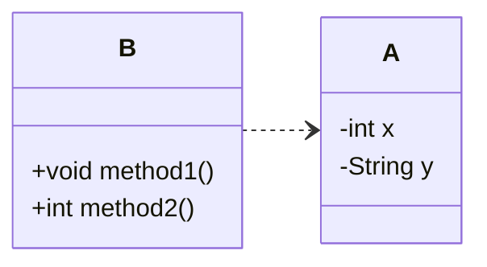

# はじめに
良いコード／悪いコードで学ぶ設計入門[^1]を読んでまとめてみます。
この本では章ごとにまとめられているので、本記事でも章ごとの気づきについてまとめてみたいと思います。
[^1]:https://gihyo.jp/book/2025/978-4-297-14622-1

## 2章(関心の分離)
`関心の分離`とは目的や内容を異なるものを一つにせず、それぞれ分けて独立させるということ。
分離せずにコードを書いてしまうと、修正漏れ、理解の低下にもつながってしまう。

## 3章(カプセル化)
### カプセル化
変更を容易にさせる手段として、`カプセル化`があげられます。
`カプセル化`とはあるデータとその処理に関わるロジックを一つのものにまとめることです。
Javaやc#などのオブジェクト指向言語ではクラスとしてカプセル化を構成していくことになります。

### なんでカプセル化が必要なのだろう？
第一の考えとして、`クラスが単体で正常に動作すること`があげられます。
例えば下記のようにデータ設計がされていたとします。

この構造ではインスタンス変数を操作するロジックが別のクラス[^2]として、定義されているため関連性がわかりにくく、コードの修正漏れ、重複などが発生する原因につながります。
このような構造をなくし、インスタンス変数とメソッドを統合し、不正値や欠損なく、クラス単体で正確に維持する方法[^3]として、`カプセル化`が必要となるのです。

[^2]:このようなクラスは貧血ドメインモデルと呼ばれる。
[^3]:ドメインモデルの完全性と呼ばれる。

### カプセル化させる手段
- コンストラクタを用意する(初期化のエラーはなくすため。)
- `final`をつけてインスタンス変数、メソッドの変数はすべて不変にし、書き換えできないようにする。
- 不変の値を変更させるときはインスタンスを再生成させるようにする。
- メソッド引数についてもプリミティブは極力避けて、インスタンスを受け取るようにする。

```java
class ProductStock {
  final int quantity;

  ProductStock(final int quantity) {
    if (quantity < 0) {
      throw new IllegalArgumentException("在庫数は0以上を指定してください。");
    }
    this.quantity = quantity;
  }
  
  ProductStock add(final ProductStock other) {
    final int added = this.quantity + other.quantity;
    return new ProductStock(added); // インスタンスを生成する。
  }
}
```


## 4章(ミュータブルとイミュータブルについて)
### ミュータブルがもたらす危険性
ミュータブルなインスタンス変数やメソッドには予期せぬ副作用を生み出す可能性があるため、使わないようにする。
インスタンス変数やメソッド引数には`final`をつけ、再代入をできない形にする。

### ミュータブルの使用を検討をする場面
ミュータブルにしてしまうと、上記のような意図しない影響を与えてしまう可能性があるため、デフォルトはイミュータブルが推奨されます。
しかし、イミュータブルな構造では、毎回インスタンスを生成する必要があるため、値の変更が膨大に発生するようなパフォーマンスを意識する場面ではミュータブルを検討する場面になります。

## 第5章(バラバラなデータになる要因)
バラバラなデータ構造や重複を生み出す原因は他にもあります。
### プリミティブに執着する
intやstring,booleanなど標準で用意されている型を`プリミティブ型`といいます。
プリミティブ型を使ってしまうとデータについての関係性や理解が薄くなってしまい、重複したコードが多くなってしまう。そのため、クラスを渡してメソッドを定義するようにする。
```java
// bad
    void register(String email, String password) {...}
// good
    void register(EmailAddress email, Password password) {...}
```
### staticについて
`static`メソッドはインスタンス変数を扱えないため、データとメソッドが乖離してしまう。(カプセル化ができない。)
`static`がついていなくても、実質的にstaticなメソッドがあるため、注意する。
```java
// インスタンス変数を使っておらず、ロジックだけが独立している。
int calculateTotal(int unitPrice, int quantity) {
return unitPrice * quantity;
}
```

### ファクトリメソッドの活用
`ファクトリメソッド`とはインスタンスを生成を専門としたstaticメソッドです。
ファクトリメソッドを用いることで、外部からインスタンスが生成できなくなるので、変更を容易にさせることができる。
```java
class CouponDiscount {
  final int amount;

  CouponDiscount(final int amount) {
    if (amount < 0) throw new IllegalArgumentException("割引額は0以上です");
    this.amount = amount;
  }
}
// 変更するには呼び出しているコードを直接参照しにいかなければならない。
CouponDiscount firstPurchase = new CouponDiscount(500);
CouponDiscount birthday = new CouponDiscount(1000);

class CouponDiscount {
  private static final int FIRST_PURCHASE_DISCOUNT = 500;
  private static final int BIRTHDAY_DISCOUNT = 1000;
  private static final int ANNIVERSARY_DISCOUNT = 2000;

  final int amount;

  // privateで外部から隠す
  private CouponDiscount(final int amount) {
    if (amount < 0) throw new IllegalArgumentException("割引額は0以上です");
    this.amount = amount;
  }

  static CouponDiscount forFirstPurchase() {
    return new CouponDiscount(FIRST_PURCHASE_DISCOUNT);
  }

  static CouponDiscount forBirthday() {
    return new CouponDiscount(BIRTHDAY_DISCOUNT);
  }
}
// staticで呼び出す
CouponDiscount firstPurchase = CouponDiscount.forFirstPurchase();
CouponDiscount birthday = CouponDiscount.forBirthday();
```

### 共通化に関して
頻繁に再利用されるような処理であっても共通クラスとして`common,utils`にまとめてしまうのはbad
例外処理やデバック処理などアプリケーションの中で幅広く使われるもの[^4]は共通クラスにまとめてもよい。

[^4]:横断的関心事という