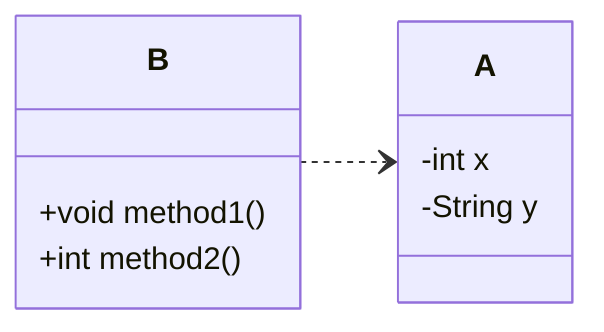

# はじめに
良いコード／悪いコードで学ぶ設計入門[^1]を読んで要点をまとめてみます。
この本では章ごとにまとめられているので、本記事でも章ごとの気づきについてまとめてみたいと思います。
[^1]:https://gihyo.jp/book/2025/978-4-297-14622-1

## 3章(カプセル化)
### カプセル化
変更を容易にさせる手段として、`カプセル化`があげられます。
`カプセル化`とはあるデータとその処理に関わるロジックを一つのものにまとめることです。
Javaやc#などのオブジェクト指向言語ではクラスとしてカプセル化を構成していくことになります。

### なんでカプセル化が必要なのだろう？
第一の考えとして、`クラスが単体で正常に動作すること`があげられます。
例えば下記のようにデータ設計がされていたとします。

この構造ではインスタンス変数を操作するロジックが別のクラス[^2]として、定義されているため関連性がわかりにくく、コードの修正漏れ、重複などが発生する原因につながります。
このような構造をなくし、インスタンス変数とメソッドを統合し、不正値や欠損なく、クラス単体で正確に維持する[^3]方法として、`カプセル化`が必要となるのです。

[^2]:貧血ドメインモデルという。データだけを持ちロジックを持たないクラスのこと。ビジネスロジックが外部に散らばりやすくなる。
[^3]:ドメインモデルの完全性という。クラス単体で常に正しい状態を保てるよう、不正な値や欠損が生じないことを保証する考え方。

### カプセル化させる手段
- コンストラクタを用意する(初期化のエラーはなくすため。)
- `final`をつけてインスタンス変数、メソッドの変数はすべて不変にし、書き換えできないようにする。
- 不変の値を変更させるときはインスタンスを再生成させるようにする。
- メソッド引数についてもプリミティブは極力避けて、インスタンスを受け取るようにする。

```java
class ProductStock {
  final int quantity;

  ProductStock(final int quantity) {
    if (quantity < 0) {
      throw new IllegalArgumentException("在庫数は0以上を指定してください。");
    }
    this.quantity = quantity;
  }
  
  ProductStock add(final ProductStock other) {
    final int added = this.quantity + other.quantity;
    return new ProductStock(added); // インスタンスを生成する。
  }
}
```


## 4章(ミュータブルとイミュータブルについて)
### ミュータブルがもたらす危険性
ミュータブルなインスタンス変数やメソッドには予期せぬ副作用を生み出す可能性があるため、使わないようにする。
インスタンス変数やメソッド引数には`final`をつけ、再代入をできない形にする。

### ミュータブルの使用を検討をする場面
ミュータブルにしてしまうと、上記のような意図しない影響を与えてしまう可能性があるため、デフォルトはイミュータブルが推奨されます。
しかし、イミュータブルな構造では、毎回インスタンスを生成する必要があるため、値の変更が膨大に発生するようなパフォーマンスを意識する場面ではミュータブルを検討する場面になります。

## 第5章(バラバラなデータになる要因)
バラバラなデータ構造や重複を生み出す原因は他にもあります。
### プリミティブに執着する
intやstring,booleanなど標準で用意されている型を`プリミティブ型`といいます。
プリミティブ型を使ってしまうとデータについての関係性や理解が薄くなってしまい、重複したコードが多くなってしまう。そのため、クラスを渡してメソッドを定義するようにする。
```java
// bad
    void register(String email, String password) {...}
// good
    void register(EmailAddress email, Password password) {...}
```
### staticについて
`static`メソッドはインスタンス変数を扱えないため、データとメソッドが乖離してしまう。(カプセル化ができない。)
`static`がついていなくても、実質的にstaticなメソッドがあるため、注意する。
```java
// インスタンス変数を使っておらず、ロジックだけが独立している。
int calculateTotal(int unitPrice, int quantity) {
return unitPrice * quantity;
}
```

### ファクトリメソッドの活用(staticが好まれる例)
`ファクトリメソッド`とはインスタンスを生成を専門としたstaticメソッドです。
ファクトリメソッドを用いることで、外部からインスタンスが生成できなくなるので、変更を容易にさせることができます。
```java
class CouponDiscount {
  final int amount;

  CouponDiscount(final int amount) {
    if (amount < 0) throw new IllegalArgumentException("割引額は0以上です");
    this.amount = amount;
  }
}
// 変更するには呼び出しているコードを直接参照しにいかなければならない。
CouponDiscount birthday = new CouponDiscount(1000);

class CouponDiscount {
  private static final int BIRTHDAY_DISCOUNT = 1000;
  final int amount;

  // privateで外部から隠す
  private CouponDiscount(final int amount) {
    if (amount < 0) throw new IllegalArgumentException("割引額は0以上です");
    this.amount = amount;
  }

  static CouponDiscount forBirthday() {
    return new CouponDiscount(BIRTHDAY_DISCOUNT);
  }
}
// staticで呼び出す
CouponDiscount birthday = CouponDiscount.forBirthday();
```

### 共通化に関して
頻繁に再利用されるような処理であっても共通クラスとして`common,utils`にまとめてしまうのはbad
例外処理やデバック処理などアプリケーションの中で幅広く使われるもの[^4]は共通クラスにまとめてもよい。

[^4]:横断的関心事という。ログ出力・例外処理・認証など、複数のモジュールにまたがって共通で必要となる処理のこと。

## 6章（関心の分離）
`関心` とはソフトウェアの機能や目的のこと。
`関心の分離` とは、それぞれのモジュールが担う関心を1つに絞り、互いに独立させること。

### インターフェースの活用
`インターフェース` とは、外から見た窓口（公開メソッド）のこと。Java の `interface` に限らず、「利用者が使える操作の一覧」を指す。
インターフェースは入力と結果だけを定義し、内部のロジックは定義しない[^5]。
これによって利用者はインターフェースを呼び出すだけとなり、仕様の変更があってもそのモジュールの内部を変更するだけでよく、利用者には影響を与えない形となる。
[^5]:シグネチャという。メソッド名・引数の型・戻り値の型など、メソッドの外部から見えるインターフェース部分の定義のこと。

### 関心の分離をする上でのポイント
- 使いたい変数に関係があるからといってまとめるのではなく、アプリケーション上の `目的` ごとに分離をし、カプセル化をする。1つのモジュールが担う関心は1つに絞ることが重要。
- 入力、結果、処理の3つを意識し、設計した上でコードを書く。
- インターフェースと実装の分離をする。利用者は「何ができるか」だけ知ればよく、内部のロジックを知らなくてよい。

## 7章(関心の分離(実践))
### 単一責任の原則
`単一責任の原則`とはクラスが担う責任をただ１つに限定するということ。
共通したように見えるロジックについて目的の違うものがそれを利用してしまうと、責任が二重になってしまうので避ける。
単一責任の原則を破ってしまうと、変更時の修正が難しく、予期せぬ影響を与えてしまう恐れがある。
```java
// 一般会員(購入金額の1%)
int getBasePoint(int purchaseAmount) {
    return purchaseAmount / 100;
}

// シルバー会員(内部が一般会員のロジックに依存しており、一般会員の責任が単一でなくなっている。)
private static final int RATE_MULTIPLIER = 3;
int point = PointCalculator.getBasePoint(purchaseAmount) * RATE_MULTIPLIER;
```

### DRY原則
上記の例のように単一責任の原則が破られてしまう背景として、`ロジックが似ているから`という点があると思います。
DRY原則という、**知識の重複**を避けるという原則がありますが、今回の例は適用されません。
それは **目的が異なる** からです。目的が違う＝別の知識なので、コードが似ていても共通化の対象にはならない。

### 継承について
javaでは`extends`句を使うことで親クラスを継承することができますが、そもそも**推奨されません。**
理由としてはサブクラスは親クラスに強く依存してしまい、予期せぬ問題が発生しやすいからです。
```java
class RegularPrice {
  int itemPrice() {
    return 1000;
  }

  int doublePrice() {
    return itemPrice() * 2;
  }
}
class MemberPrice extends RegularPrice {
  @Override
  int itemPrice() {
    // ここは1000 - 200で800となり、大丈夫
    return super.itemPrice() - 200;
  }

  @Override
  int doublePrice() {
    // ここが2000 - 100で1900を期待するものの、800 * 2 - 100で1500となってしまう。
    // MemberPriceのitemsPriceを実行してしまう(ポリモーフィズム)
    return super.doublePrice() - 100;
  }
}
```
スーパークラスの依存を回避するため、利用したいクラスをprivateなインスタンスとして利用する方法[^6]があります。
[^6]:コンポジション構造という。継承の代わりに、利用したいクラスをインスタンス変数として内部に持つことで機能を再利用する設計パターン。継承による密結合を避けられる。
```java
class MemberPrice {
  private final RegularPrice regularPrice;
  MemberPrice() {
    this.regularPrice = new RegularPrice();
  }
  int doublePrice() {
    return regularPrice.doublePrice() - 100;
  }
}
```

## 8章(条件分岐)
- ネストの深いif文やわかりにくいelse句に対しては`早期return`を使う。
- switch文を使うときは同じ条件式の時には重複させず、一つにまとめる(これは単一責任の原則の観点にも当てはまる。)

### switch文とinterfaceの活用
`interface`は機能を定義する部分であり、中身のロジックに関しては気にしません。
要するにinterfaceは入力と出力さえあっていればどのクラス(モジュール)に対してもinterfaceのオブジェクトとしてみなすことができます。
そのため、Javaではクラスの型が異なっていても、一つのinterface型として扱うことができます。
```java
interface Notification {
  void send();
}
class EmailNotification implements Notification { ... }
class PushNotification implements Notification { ... }

class NotificationSender {
  void send(Notification notification) {
    // どのクラスを受け取るかではなく、インターフェースとして実行できる。
    notification.send();
  }
}
```
interfaceを活用することで、switch文による条件分岐を排除できます。
switch文が担っていた分岐の責任を、interfaceを通じて各クラス自身に移すことができます。
もう一点のメリットとして、interfaceを実装する際にメソッドの未実装があれば、コンパイル時に検知できる点があげられます。
```java
String displayName;
int fee;
switch (type) {
  // 支払い方法が増えるたびに条件分岐が増える。項目に追加漏れが発生する可能性もある。
  case CREDIT_CARD:
    displayName    = "クレジットカード";
    fee            = 0;
    break;
  case CONVENIENCE:
    displayName    = "コンビニ払い";
    fee            = 200;
    break;
}

interface PaymentProcessor {
  String displayName();
  int fee();
}
// 各クラスごとに分けて実装する。
class CreditCard implements PaymentProcessor {
  public String displayName() {
    return "クレジットカード";
  }

  public int fee() {
    return 0;
  }
}

// Mapで定義して、受け取ったtypeに合わせて、各クラスを返却する。
private final Map<PaymentType, PaymentProcessor> processors = Map.of(
  PaymentType.CREDIT_CARD,   new CreditCard(),
  PaymentType.CONVENIENCE,   new ConveniStore()
);

PaymentProcessor get(PaymentType type) {
  PaymentProcessor processor = processors.get(type);
  if (processor == null) throw new IllegalArgumentException("未対応: " + type);
  return processor;
}
```

### interfaceを使えるようになるには
1. まずはその機能が取り扱っている単位(区分)をみつけ、まとめてみる。
2. 機能について、それぞれの内容における入力と出力を考え、共通点を見つける。
3. 見つけた共通点からinterfaceと各クラスを定義してみる。
4. 最後に、メソッドを呼び出してメソッド引数を変えるだけで各クラスが呼び出せるようにする。

### 条件分岐とinterface
switch文をinterfaceで取り換えられたように、条件分岐に関しても判定条件自体をinterfaceで定義し、一つのポリシークラスとしてまとめることによって置き換えることができます。
ポリシークラスに各ルールを適用することで再利用できたり、柔軟な条件を適用できます。
```java
interface UserRule {
  boolean ok(UserActivity activity);
}
class AdultAgeRule implements UserRule {
  public boolean ok(UserActivity activity) {
    return 18 <= activity.age;
  }
}
class UserPolicy {
  private final Set<UserRule> rules;
  UserPolicy() {
    this.rules = new HashSet<>();
  }
  void add(UserRule rule) {
    rules.add(rule);
  }
}
// ルールを追加
policy.add(new AdultAgeRule());
```

## 9章(コレクションについて)
- 標準で用意されているメソッドがある場合、自前で実装しないようにする。
- 早期returnと同じく、ループ中の条件分岐には先にcontinueを使う。(breakも同様)
- コレクションに関するロジックはクラスに分散しやすいので、コレクションのインスタンス変数と操作するメソッドでカプセル化[^7]をする。(この時、他のインスタンス変数は持たせない。コレクション専用のカプセル化を行う。)
- コレクションに関するメソッドは破壊的な処理はせず、新たにコレクションを作成して副作用のないメソッドにする。
- コレクションを返却する場合には`unmodifiableList()`メソッドを使用して、読み取り専用にする。

[^7]:ファーストクラスコレクションという。コレクションを1つだけ持つクラスとして定義し、コレクションに関するロジックをそのクラスに集約するパターン。