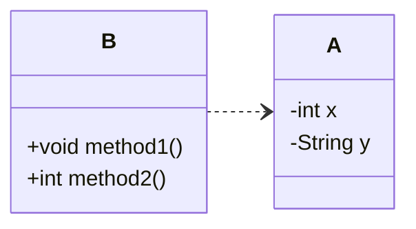

# はじめに
良いコード／悪いコードで学ぶ設計入門[^1]を読んでまとめてみます。
この本では章ごとにまとめられているので、本記事でも章ごとの気づきについてまとめてみたいと思います。
[^1]:https://gihyo.jp/book/2025/978-4-297-14622-1

## 2章(関心の分離)
### 関心の分離
例えば以下のようなユーザー登録のコードがあったとします。
```java
public class UserRegistrationLogic {
  String userName;
  String userEmail;
  String userPassword;

  boolean canRegister() {
    boolean isValid = true;
    if (userName == null || userName.length() == 0) {
      isValid = false;
    }
    if (userEmail == null || !userEmail.contains("@")) {
      isValid = false;
    }
    if (userPassword == null || userPassword.length() < 8) {
      isValid = false;
    }
    return isValid;
  }
}
```
ここではユーザー名やemail、パスワードなどのバリデーションを行なっていますが、１つの登録できるかどうかというメソッドに複数の処理が入っています。
ここで以下のように書き換えてみます。
```java
  boolean isValidName(String name) {
    return name != null && !name.isEmpty();
  }

  boolean isValidEmail(String email) {
    return email != null && email.contains("@");
  }

  boolean isValidPassword(String password) {
    return password != null && password.length() >= 8;
  }

  boolean canRegister() {
    boolean isNameValid = isValidName(userName);
    boolean isEmailValid = isValidEmail(userEmail);
    boolean isPasswordValid = isValidPassword(userPassword);
    return isNameValid && isEmailValid && isPasswordValid;
  }
```
このように、目的が異なることをメソッドとして分離することで、それぞれの処理がわかりやすくなり、変更を容易にしてくれるようになります。

## 3章(カプセル化)
### カプセル化
変更を容易にさせる手段として、`カプセル化`があげられます。
`カプセル化`とはあるデータとその処理に関わるロジックを一つのものにまとめることです。
Javaやc#などのオブジェクト指向言語ではクラスとしてカプセル化を構成していくことになります。

### なんでカプセル化が必要なのだろう？
第一の考えとして、`クラスが単体で正常に動作すること`があげられます。
例えば下記のようにデータ設計がされていたとします。

この構造ではインスタンス変数を操作するロジックが別のクラス[^2]として、定義されているため関連性がわかりにくく、コードの修正漏れ、重複などが発生する原因につながります。
他にも、初期化処理、不正値が入らないようにするためのバリデーションもなどの工夫が必要となります。
このような構造をなくし、インスタンス変数とメソッドを統合し、不正値や欠損なく、クラス単体で正確に維持する方法[^3]として、`カプセル化`が必要となるのです。

[^2]:このようなクラスは貧血ドメインモデルと呼ばれる。
[^3]:ドメインモデルの完全性と呼ばれる。


### うまくカプセル化するには
#### 正常値を設定する。
以下のようなクラスがあったとします。
```java
public class ProductStock{
  int quantity;
}
```
このクラスでは初期化するコンストラクタが含まれていないため、意図しないバグが生まれてしまう可能性があります。
そのため、できる限りコンストラクタを用意します。
```java
public class GoodMoney {
    int amount;
    Currency currency;

    GoodMoney(
            int amount,
            Currency currency) {
        this.amount = amount;
        this.currency = currency;
    }
}
```
しかしこれでは、amountなどの量に負の数を引き渡すことも可能であり、不正値を許してしまいます。
そのため、以下のように編集して、不正値を許さないインスタンス変数にします。
```java
  Money(final int amount, final Currency currency) {
    if (amount < 0) {
      throw new IllegalArgumentException("金額には0以上を指定してください。");
    }
    if (currency == null) {
      throw new NullPointerException("通貨単位を指定してください。");
    }

    this.amount = amount;
    this.currency = currency;
  }
```
これで不正値を許さない、コンストラクタにすることができました。

#### 計算ロジックを持たせる。
現状のMoneyクラスではデータの保持だけで、ロジックがなく、ここで別クラスに処理に関してのメソッドを追加してしまうと、単一としてのクラスで完結しなくなってしまい、困難になります。

そのため、金額を追加するロジックもMoneyクラスに追加してみます。
```java
Money add (int value) {
    this.amount += value
}
```
現状のインスタンス変数では代入が可能(ミュータブル)であるため、意図しない値や理解が難しくなります。
そのため、`final`修飾子をつけて、不変(イミュータブル)にします。
```java

```