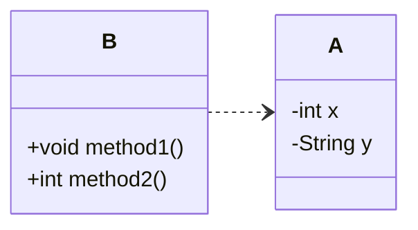

# はじめに
良いコード／悪いコードで学ぶ設計入門[^1]を読んでまとめてみます。
この本では章ごとにまとめられているので、本記事でも章ごとの気づきについてまとめてみたいと思います。
[^1]:https://gihyo.jp/book/2025/978-4-297-14622-1

## 2章(関心の分離)
### 関心の分離
例えば以下のようなユーザー登録のコードがあったとします。
```java
public class UserRegistrationLogic {
  String userName;
  String userEmail;
  String userPassword;

  boolean canRegister() {
    boolean isValid = true;
    if (userName == null || userName.length() == 0) {
      isValid = false;
    }
    if (userEmail == null || !userEmail.contains("@")) {
      isValid = false;
    }
    if (userPassword == null || userPassword.length() < 8) {
      isValid = false;
    }
    return isValid;
  }
}
```
ここではユーザー名やemail、パスワードなどのバリデーションを行なっていますが、１つの登録できるかどうかというメソッドに複数の処理が入っています。
ここで以下のように書き換えてみます。
```java
  boolean isValidName(String name) {
    return name != null && !name.isEmpty();
  }

  boolean isValidEmail(String email) {
    return email != null && email.contains("@");
  }

  boolean isValidPassword(String password) {
    return password != null && password.length() >= 8;
  }

  boolean canRegister() {
    boolean isNameValid = isValidName(userName);
    boolean isEmailValid = isValidEmail(userEmail);
    boolean isPasswordValid = isValidPassword(userPassword);
    return isNameValid && isEmailValid && isPasswordValid;
  }
```
このように、目的が異なることをメソッドとして分離することで、それぞれの処理がわかりやすくなり、変更を容易にしてくれるようになります。

## 3章(カプセル化)
### カプセル化
変更を容易にさせる手段として、`カプセル化`があげられます。
`カプセル化`とはあるデータとその処理に関わるロジックを一つのものにまとめることです。
Javaやc#などのオブジェクト指向言語ではクラスとしてカプセル化を構成していくことになります。

### なんでカプセル化が必要なのだろう？
第一の考えとして、`クラスが単体で正常に動作すること`があげられます。
例えば下記のようにデータ設計がされていたとします。

この構造ではインスタンス変数を操作するロジックが別のクラス[^2]として、定義されているため関連性がわかりにくく、コードの修正漏れ、重複などが発生する原因につながります。
他にも、初期化処理、不正値が入らないようにするためのバリデーションもなどの工夫が必要となります。
このような構造をなくし、インスタンス変数とメソッドを統合し、不正値や欠損なく、クラス単体で正確に維持する方法[^3]として、`カプセル化`が必要となるのです。

[^2]:このようなクラスは貧血ドメインモデルと呼ばれる。
[^3]:ドメインモデルの完全性と呼ばれる。


### うまくカプセル化するには
#### 正常値を設定する。
以下のようなクラスがあったとします。
```java
class ProductStock{
  int quantity;
}
```
このクラスでは初期化するコンストラクタが含まれていないため、意図しないバグが生まれてしまう可能性があります。
そのため、できる限りコンストラクタを用意します。
```java
class ProductStock{
  int quantity;

  ProductStock(int quantity) {
    this.quantity = quantity;
  }
}
```
しかしこれでは、quantityなどの量に負の数を引き渡すことも可能であり、不正値を許してしまいます。
そのため、以下のように編集して、不正値を許さないインスタンス変数にします。
```java
  ProductStock(int quantity) {
    if (quantity < 0) {
      throw new IllegalArgumentException("在庫数は0以上を指定してください。");
    }
    this.quantity = quantity;
  }
```
これで不正値を許さない、コンストラクタにすることができました。

#### 計算ロジックを持たせる。
現状のクラスではデータの保持だけで、ロジックがなく、ここで別クラスに処理に関してのメソッドを追加してしまうと、単一としてのクラスで完結しなくなってしまい、困難になります。

そのため、在庫数を増やすメソッドを追加してみます。
```java
  void add(int amount) {
    if (amount < 0) {
      throw new IllegalArgumentException("入荷量は0以上を指定してください。");
    }
    this.quantity += amount;
  }
```
現状のインスタンス変数やメソッド引数では代入が可能(ミュータブル)であるため、意図しない値や理解が難しくなります。
そのため、`final`修飾子をつけて、不変(イミュータブル)にします。
```java
class ProductStock {
  final int quantity;

  ProductStock(final int quantity) {
    if (quantity < 0) {
      throw new IllegalArgumentException("在庫数は0以上を指定してください。");
    }
    this.quantity = quantity;
  }
  ProductStock add(final int amount) {
    if (amount < 0) {
      throw new IllegalArgumentException("入荷量は0以上を指定してください。");
    }
    final int added = quantity + amount;
    return new ProductStock(added);
  }
}
```
最後の修正点として、このメソッドでは在庫量が単なる`int`として定義されてしまっています。
このままでは`int`であるものの、全く関係のない値が入ってしまう恐れがあります。
そのため、メソッド引数を`int`ではなく、インスタンスそのものを受け取るようにします。
```java
  ProductStock add(final ProductStock other) {
    final int added = this.quantity + other.quantity;
    return new ProductStock(added);
  }
```

## 4章(ミュータブルとイミュータブルについて)
### ミュータブルがもたらす危険性
ミュータブルなインスタンス変数は単にコードの理解を下げるだけでなく、予期せぬ副作用を与えてしまう場合があります。
下記のようなコードがあったとします。
```java
class SellingPrice {
  static final int MIN = 0;
  int priceYen; // ミュータブル

  SellingPrice(int priceYen) {
    if (priceYen < MIN) {
      throw new IllegalArgumentException();
    }
    this.priceYen = priceYen;
  }
}

class CatalogEntry {
  final String name;
  final SellingPrice sellingPrice;

  CatalogEntry(String name, SellingPrice sellingPrice) {
    this.name = name;
    this.sellingPrice = sellingPrice;
  }
}

SellingPrice masterPrice = new SellingPrice(1000);
CatalogEntry coffee = new CatalogEntry("コーヒー", masterPrice);
CatalogEntry sandwich = new CatalogEntry("サンドイッチ", masterPrice);

coffee.sellingPrice.priceYen -= 200;

System.out.println(coffee.sellingPrice.priceYen); // 800
System.out.println(sandwich.sellingPrice.priceYen); // 800
```
この例のように、ミュータブルな値にしてしまうと意図しないところで値が変化してしまう場合があります。これらはメソッドでも当てはまります。
そのため、基本的には`final`修飾子をつけて、イミュータブルな設計を心がけるようにします。

### ミュータブルの使用を検討をする場面
ミュータブルにしてしまうと、上記のような意図しない影響を与えてしまう可能性があるため、デフォルトはイミュータブルが推奨されます。
しかし、イミュータブルな構造では、毎回インスタンスを生成する必要があるため、値の変更が膨大に発生するようなパフォーマンスを意識する場面ではミュータブルを検討する場面になります。

## 第5章(バラバラなデータになる要因)
バラバラなデータ構造や重複を生み出す原因は他にもあります。
### プリミティブに執着する
intやstring,booleanなど標準で用意されている型を`プリミティブ型`といいます。
