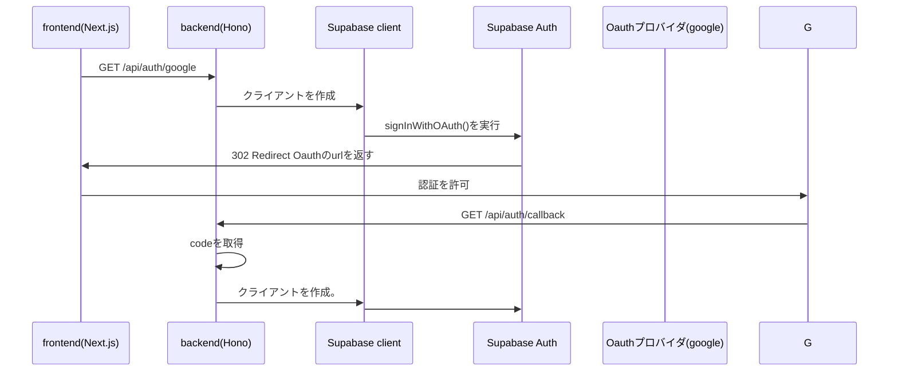

## 初めに
今回はhonoを使ってバックエンドからsupabaseのOAuth認証(google)を実装する方法について
まとめてみます。
認証についてバックエンドを経由することで、フロントエンドはUIに集中させ、バックエンドに
ロジックを任せることを目的としています。
### 実装する内容について
以下のような点を実装することをまとめてみます。
- googleでのユーザー登録、ログイン
- ユーザーの情報として、ユーザー名とアイコンを登録させる。

## どのように実装するのか？
実装方法について以下のようなフローを考えました。
