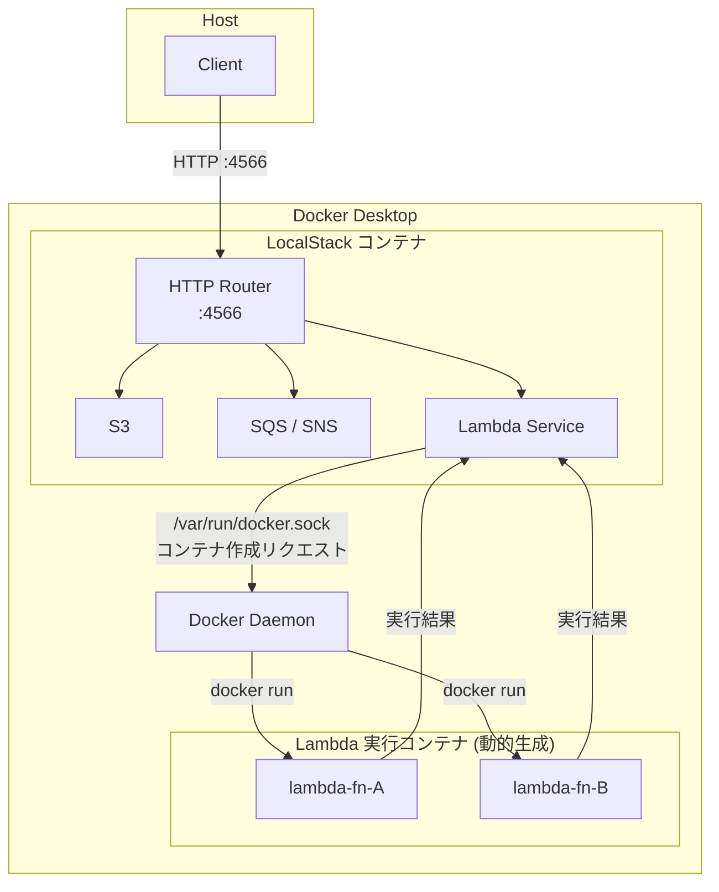

# 初めに
localstackはawsの環境をローカルマシンで動かすことができるサービスです。
これにより、lambdaやcloudformation,s3などawsの環境を使ってテストしたいことを無料で行うことができます(一部のサービスは有料)
今回は下記のスタックを使ってローカル上でlambdaを実行したいと思います。

| 技術 | 詳細 |
| --- | --- |
| Spring Cloud Function | Lambdaハンドラをfunctionとして実装するSpringフレームワーク |
| Spring Boot | 3.5.14 |
| Docker Desktop | LocalStackのランタイム環境 |
| CloudFormation | Lambdaリソースの定義・デプロイに使用 |
| Lambda ランタイム | Java 21 |

## localstackのインストール
[localstack](https://app.localstack.cloud/)にアクセスしてアカウントを作成します。
アカウントを作成すると、トークンが表示されるのでシェルでexportしておきます。
localstackでは無料、有料問わず最新のバージョンでは認証トークンが必須となりました。

```bash
LOCALSTACK_AUTH_TOKEN="xxxx"
```

:::message
認証情報の取り扱いには注意してください。
シェルに記載したくない場合は後ほど違う方法で登録することを紹介します。
:::

## localstackの概要について
localstack(docker desktopのランタイム)では以下のような構成で動きます。

localstackとの通信はデフォルトで`ポート番号:4566`で通信します。
lambdaはlocalstackとは別のコンテナで`docker.sock`経由で生成されます。

##

## 参考資料
[localstack hooks](https://docs.localstack.cloud/aws/capabilities/config/initialization-hooks/)
